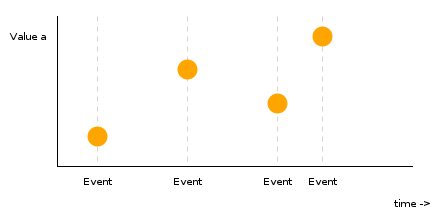
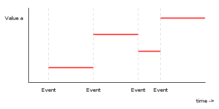
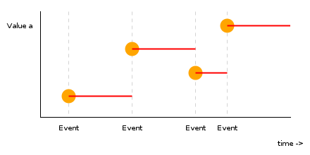

Haskellという言語で使えるWebアプリケーションフレームワークの一つに、Reflexというものがある。それを使ってSPA(Single Page Application)を実装してみる。SPAとは、サイトを一つのHTMLファイルで構成し、データベースへのアクセスやページの描画をすべてブラウザ側でやってしまうと言うもの。

今回は、一つのHTMLファイルにサーバへの全通信を繋げて、JavascriptがURLをもとにサイトのルーティングをし、ページのレンダリングをする仕組みを実装する。こうすることで、ブラウザがサーバ内のどのURLにアクセスしても同じHTMLファイルがダウンロードされるが、描画されるページはURLによって変わるようになる。また、一度サーバにアクセスした後は、サイト内のページの切り替わりは全てブラウザ側でするようになる。

## GHCJSとReflex

HaskellコンパイラのひとつであるGHCは、以下の流れでプログラムを機械語に変換している。[^1]


<small>http://www.scs.stanford.edu/11au-cs240h/notes/ghc.html から引用。(c) David Mazières</small>

これを見ると、処理の最後の方ではSTG形式 -> Cmm形式 -> 機械語の順で変換していることがわかるが、このSTGという中間言語になったところで、それをJavascriptに翻訳するコンパイラがGHCJSだ。[^2]

さらに、HaskellのFRP(後述)フレームワークとしてReflexというものがあり、それをGHCJSに対応させてDOM、すなわちHTMLの動的な操作ができるようになったのがReflex-DOMだ。今回はこのReflexとReflex-DOMを用いて、SPAを構築する。

フロントエンドのフレームワークにはよくあること（？）かもしれないけど、かなりソフトウェア同士の関係が複雑になっている...

## FRPとは？

ReflexはFRP(Functional Reactive Programming)フレームワークである。

簡単に言うとFRPとは、ある一つの値が変わると、それに関係した=それによって定義された他の値も自動的に変わるということだ。

たとえば、次の擬似コードについて考えてみる。

```javascript
x = 8
y = x + 1
x += 1
```

このプログラムを普通に解釈してみる。

まず最初に`x`に`8`が代入される。`x + 1`が計算され、それが`y`に代入される。その後`x`が`1`加算されるが、`y`には影響がない。最終的には、`x = 9`、`y = 9`になる。

では次に、全く同じコードを、FRP的に解釈してみよう。上記のコードはこのように解釈される。

まず最初に`x`を`8`と定義する。`y`を`x + 1`と定義する。`x`に`1`加算されるが、ここでさきほど`y`を`x`で定義したので、`y`の値を現在の`x`の値を用いて再計算する。最終的には、`x = 9`、`y = 10`になる。

FRPの重要な点は、式がずっと成り立つことだ。上記のコードにおいて、普通な解釈では`y = x + 1`は2行目までは成り立つが、3行目からは成り立たない。しかしFRP的な考え方では、`y = x + 1`はどんな場合でも成り立つ。そのように`y`が定義され、値を自動で更新するプログラムが裏で動いているからだ。

本当は、FRPにおいて上記コード内の`x += 1`という部分は、ユーザの入力、乱数、時間などの「外の世界」に関係する部分である(なぜなら、そういった不確定要素がなければ、初めから全ての変数の値が計算できてしまい、変数を更新する必要がないから)。たとえば、ボタンAを押すたび`x += 1`、1秒ごとに`x += 1`と言った具合に。すなわち、`x`は`8 + ボタンAの押された回数`や`8 + 経過秒数`として定義される。こう考えると、FRPとは「外の世界」によって変化する値の定義となる。ある意味では、「外の世界」が最初からある変数であり、それを"加工"し、それが関係する変数を作り上げることがFRPだ。Reflexの場合、最終的に生成するべきものは動的に変化するページである。それを、「外の世界」を"加工"して定義する。イメージ的にはそんな感じ。

たとえHaskellのような関数型言語であっても、「外の世界」が関係する部分は、どうしても手続き的な表現をするしかない。ユーザの入力を待つ -> `x`を更新する -> `y`を更新する、といったように。しかしFRPでは、ユーザの入力や時間経過が関係する部分でさえ、それらを定義的=関数的=Functionalに書ける。

FRPのもっとわかりやすい例として、Excelが挙げられる。Excelでは、あるセルの計算式に関係する部分を変更すると、自動的にセルの内容が再計算され、更新される。たとえば、A11をA1からA10までの数値の和(`A11 = SUM(A0:A10)`)としてやると、A1からA10までの数値をユーザが変更するたびに、A11の内容が再計算される。

## ReflexとReflex-DOMの環境構築・コンパイルのしかた
このサイトに詳しい手順が書かれている。  
<https://github.com/reflex-frp/reflex-platform>

Reflexのソースコード`your-source-file.hs`を用意した上で、以下のコマンドを順に実行する。(Linux と MacOS のみ対応)

1. `git clone https://github.com/reflex-frp/reflex-platform`
2. `cd reflex-platform`
3. `./try-reflex` (めっちゃ時間かかる)
4. `ghcjs --make your-source-file.hs`

すると、ディレクトリ`your-source-file.jsexe`が生成され、その中にHTMLやJavascriptが入っている。今回はSPAを作るので、別途サーバを立てなければいけない。

1. `cd your-source-file.jsexe`
2. `npm install express`
3. `server.js`と言う名前で以下のNode.jsプログラムを作成
```javascript
const express = require('express');
const path = require('path');
const port = process.env.PORT || 8080;
const app = express();

app.get('/:filename.js', function (request, response) {
  response.sendFile(path.join(__dirname, request.params.filename + '.js'));
});

app.get('*', function (request, response) {
  response.sendFile(path.join(__dirname, 'index.html'));
});

app.listen(port);
console.log('server started on port ' + port);
```
4. `node server.js`
5. <http://localhost:8080/> に行けば、ページが動いていることが確認できる。

## ReflexとReflex-DOMの仕組み

*注意: Reflexバージョン0.5、Reflex-DOMバージョン0.4に関する内容。*

まずはHaskell / Reflexの型・関数の書き方を説明する。

- 型の名前は必ず大文字から始まらないといけない。

- 型を小文字から書き始めた場合、どんな型でも入ると言う意味になる。ただし、同じ文字には同じ型が入る。例: 恒等写像`id :: a -> a`{.haskell}

- 関数は、1行目に`関数名 :: 引数1の型 -> ... -> 引数nの型 -> 返り値の型`、2行目に`関数名 引数1 ... 引数n = プログラム`で定義する。引数を二乗する関数の例:
  ```haskell
  func :: Int -> Int
  func n = n * n
  ```
  「funcは`Int -> Int`{.haskell}型である」や「`Int -> Int`{.haskell}型の関数funcが存在する」という意味で、`func :: Int -> Int`{.haskell}と書く場合がある。

- `Event Int`{.haskell}のような、大文字から始まる語が二語以上続く型では、内部にどんな型の値があるか指定することができる。Javaのジェネリクスみたいなやつ。たとえば、「数値もしくは文字列」を表す型は`Either Int String`{.haskell}。

- 関数への入力は、`関数名 引数1 ... 引数n`で表す。

- 関数名が記号の場合、入力を`引数1 * 引数2`のように書くことができる。この時、`* :: 引数1の型 -> 引数2の型 -> 出力の型`となる。

- Reflexにおいて、文字列は`Text`{.haskell}型をもつ。本当は`String`{.haskell}型が標準なのだけど、`Text`{.haskell}型じゃないと受け付けてくれない。

- 無名関数は、`(\引数1 ... 引数n -> プログラム)`で表す。例: `(\x -> x * x) 3`{.haskell}の値は`9`{.haskell}になる。

- 何もデータがない型(nullのようなもの)は、空タプル`()`{.haskell}で表す。

ReflexとReflex-DOMでは、4つの重要な概念が登場する。Event、Behavior、Dynamic、Widgetだ。

### Event

Eventは、ある特定の時間に発火し、何らかの値を伝える。  
Eventはキーボード入力やマウスクリックなどの「外の世界」の情報を伝える。  
たとえばキー入力だったら、キーが押された瞬間にキーコードを伝える。

以下の関数がある。

- `domEvent Click el :: Event t ()`{.haskell} - HTML要素のクリックを伝える。クリック時に発火するが、値を持たない。
- `domEvent Keypress el :: Event t Int`{.haskell} - HTML要素内でキーが押された時に発火する。キーコードを伝える。

Eventの型は`Event t a`で表される。aが内部に保持される値の型(上の例だとキーコード)。

図としてイメージすると、こんな感じになる。ある特定の時間において、Eventが発火し、その時に同時に値が伝えられる。

  
<small>(https://github.com/hansroland/reflex-dom-inbits/blob/master/tutorial.md から引用。(c) Hans Roland Senn)</small>

### Behavior

Behaviorは、通常の変数のこと。Behaviorはいかなる時点でも必ず何らかの値を持つが、いつ値が変わったのかを知ることはできない。

以下の関数がある。

- `hold :: a -> Event t a -> Widget t (Behavior t a)`{.haskell}  - Eventに初期値を与えることで、Behaviorを作る。ただし、後述のWidgetに包まれて帰ってくる。

BehaviorからEventを作ることは、Behaviorの振る舞いがわからないので不可能。図としてイメージすると、こんな感じになる。

  
<small>(https://github.com/hansroland/reflex-dom-inbits/blob/master/tutorial.md から引用。(c) Hans Roland Senn)</small>

### Dynamic

Dynamicは、EventとBehaviorの組み合わせ。つまり、変化する値と、それが変更された瞬間の両方が格納されている。

以下の関数がある。

- `current :: Dynamic t a -> Behavior t a`{.haskell}  - DynamicからBehaviorを取り出す。
- `updated :: Dynamic t a -> Event t a`{.haskell}  - DynamicからEventを取り出す。
- `holdDyn :: a -> Event t a -> Widget t (Dynamic t a)`{.haskell}  - Eventに初期値を与えることで、Dynamicを作る。ただし、後述のWidgetに包まれて帰ってくる。
- `count :: Event t a -> Widget t (Dynamic t Int)`{.haskell}  - Eventが発生した回数を数え、`Int`が格納されたDynamicを作成する。ただし、後述のWidgetに包まれて帰ってくる。
- `<$> :: (a -> b) -> (Dynamic a -> Dynamic b)`{.haskell}  - 超便利関数。任意の関数を、入力Dynamic出力Dynamicの関数に変化させることができる。じつはDynamicの親分にFunctorというものがあって、そこに入っている関数。

BehaviorからDynamicを作ることは、Behaviorの振る舞いがわからないので不可能。図としてイメージすると、こんな感じになる。EventとBehaviorの重ね合わせ。

  
<small>(https://github.com/hansroland/reflex-dom-inbits/blob/master/tutorial.md から引用。(c) Hans Roland Senn)</small>

### Widget

ページを構成する要素の事。Dynamicの値に応じて内容を動的に変化させることができる。これを作成できる関数は、

- `el :: Text -> Widget t a -> Widget t a`{.haskell}  - HTMLタグ作成。Widgetを消費してWidgetを生成しているのは、タグの中の内容を指定させるため。
- `text :: Text -> Widget t ()`{.haskell}  - 固定テキスト作成
- `dynText :: Dynamic Text -> Widget t ()`{.haskell}  - 可変テキスト作成
- `button :: Text -> Widget t (Event t ())`{.haskell}  - ボタン作成。クリックEventが付いてくる。

などがある。また、DynamicやBehaviorを生成する一部の関数は、`Widget t (Dynamic t a)`{.haskell}の形で値を返す。

例えば、`x :: Dynamic Text`{.haskell} に対し、`el "span" (dynText x)`{.haskell} は、内容がxのspan要素のこと。xの値が`"test"`{.haskell}の時、生成されるHTMLは`<span>test</span>`{.html}になる。xの値が変化するごとに、span要素の内容も連動して変化する。

do記法(Widgetの親分にMonadというものがあって、それについてくる機能)を用いると、複数のWidgetをつなげたり、`<-`を使ってWidget内部の値を"取り出す"ことができる。これは、先ほどのholdやholdDynやbuttonなどから作られる、Widgetに包まれた値を処理するのにとても役に立つ。do記法の最後の行は必ずWidgetでなければならない。そして、do記法で作られたWidgetの型はその最後の行の型と一致する。return関数を使うと、任意の値をWidgetに包むことができる。

#### span要素が三つ並んでいるWidgetの例

```haskell
widget1 :: Widget t ()
widget1 = do
  el "span" (text "テキスト1")
  el "span" (text "テキスト2")
  el "span" (text "テキスト3")
  return ()
```

見ての通り、do記法を使うと3つのelを1つに合成することができる。最後、`return ()`としているのは、widget1の型を`Widget t ()`{.haskell}にするため。

#### ボタンを押した回数を表示するWidgetの例

```haskell
widget2 :: Widget t ()
widget2 = do
  ev <- button "click me"
  dynText (count ev)
  return ()
```

`button "click me"`{.haskell} の型は`Widget t (Event t ())`{.haskell} だけど、`<-`という記号を用いると、Widgetの中の値を"取り出す"ことができる。つまり、evの型は`Event t ()`{.haskell}になる。その後これを、countに通してDynamic化し、dynTextに通してWidget化している。

## Reflexソースコードの書き方

先ほどの、「ボタンを押した回数を表示するWidget」を、実際にソースコードにすると、こうなる。

```haskell
{-# LANGUAGE OverloadedStrings #-}

import Reflex.Dom

main :: IO ()
main = mainWidget $ do
  ev <- button "click me"
  dynText (count ev)
  return ()
```

1行目でOverloadedStrings言語拡張を導入して、自動的に文字列がText型に変換されるようにしている。これを入れないと、`"click me"`{.haskell}がString型として扱われてしまい、コンパイルエラーが発生する。

3行目でReflex及びReflex-DOMをインポートしている。

5~9行目で、Haskellプログラムのエントリーポイントである`main :: IO ()`{.haskell}関数を定義している。`mainWidget`を使うと、WidgetをIOに変換してくれる。`$ :: (a -> b) -> a -> b`{.haskell}は、関数を適用する関数。mainWidgetにdo以降を入力し、IOを得ている。普通に括弧を使えばいいかもしれないが、この方がちょっと綺麗。

## ルーティングの実装

今回は、一つのHTMLファイルにサーバへの全通信を繋げて、HTML内のJavascriptが接続先パスをもとにサイトのルーティングをする仕組みを作る。この際、複数のページが存在し、それぞれのページから他のページへのリンクを張ることができる。

ルーティングを実装するために、まずは現在のパスによって動的に変化するWidgetを生成する。そのWidgetから、次にどのページに遷移するかを決めるEventを取り出し、パスの変化に反映させる。「パスが変わると、パスの変わり方も変わる」というわけだ。早速取りかかってみよう。

- パスを格納するDynamicを`loc :: Dynamic t Text`{.haskell} として扱う。

- 「ページ」の型を`Widget t (Event t Text)`{.haskell} と定義する。これは、ページの内容と、さらにパスの変更、つまり次のページが何になるかを指し示すEventを保持している。

- パスを入れたら対応するページが出てくる関数`getPage :: Text -> Widget t (Event t Text)`{.haskell} があるものとする。

まずは、先ほど紹介した超便利関数`<$>`を使って、動的に変化するWidgetを作る。

```haskell
getPage <$> loc :: Dynamic t (Widget t (Event t Text))
```

この型は、「動的に変化する、Text型のEventを格納したWidget」と言う意味になる。しかし、このままではDynamicに包まれたWidgetができるだけで、Widgetを作れない。最終的に作るべきものはWidgetだから、何とかして中身のWidgetを外に持ってくる必要がある。そこでReflex-DOMの`dyn`関数を使う。これは、「Widgetが入ったDynamic」を、Dynamicが変化するごとに更新されるWidgetに変換する関数だ。

```haskell
dyn :: Dynamic t (Widget t a) -> Widget t (Event t a)
```

これに、先ほどの`getPage <$> loc`を適用すると...

```haskell
dyn (getPage <$> loc) :: Widget t (Event t (Event t Text))
```

が出てくる。これで、Widgetを一番外に持ってくることができたが、問題が発生する。Eventが二重になってしまった。今度はこれを一重にしなければならない。

ここで、外側のEventと内側のEventとの違いについて考えてみる。外側のEventは、dyn関数がDynamicをWidgetに変換する時についてきたもので、発火のタイミングは`updated loc`と等しい。[^3]しかし、今欲しいものは、`getPage <$> loc`の中身である。だから、外側のEventは無視して、内側のEventのみ採用する。

さて、内側のEventだけを採用する方法はいくつかあるが、今回は`hold`、`never`、`switch`を組み合わせた方法を用いる。

- `hold :: a -> Event t a -> Widget t (Behavior t a)`{.haskell}
  Eventに初期値を与えることでBehaviorを作る。

- `never :: Event t a`{.haskell}
  絶対に発火しないEvent。絶対に発火しないので、値を必要をしない。だから値の型は何でもよくなる。

- `switch :: Behavior t (Event t a) -> Event t a`{.haskell}
  Eventが入ったBehaviorから、内部のEventを取り出す。

最初に`dyn (getPage <$> loc)`でEventが入ったEventを作る。次に`hold`と`never`を使って、Eventが入ったBehaviorを作る。最後に`switch`を使って、Eventを作ればよい。こうして、`loc`から対応するページを描画し、ページから発生するEventを抽出できた。

```haskell
func :: Dynamic t Text -> Widget t (Event t Text)
func loc = do
  eventOfEvent <- dyn (getPage <$> loc)
  behaviorOfEvent <- hold never eventOfEvent
  return (switch behaviorOfEvent)
```

次に、このEventとmdo記法を使って、locを定義する。これで、ルーティングは完成だ。

```haskell
{-# LANGUAGE RecursiveDo #-}

site :: Widget t ()
site = mdo
  eventOfEvent <- dyn (getPage <$> loc)
  behaviorOfEvent <- hold never eventOfEvent
  loc <- holdDyn "/" (switch behaviorOfEvent)
  return ()
```

`do`が`mdo`に変わり、`RecursiveDo`言語拡張を導入している。こうすると、まるで未来予知するかのように、`loc`が定義される前から`loc`が使える。

実際には何をやっているかというと、まず`loc`の値を計算するべく、`switch behaviorOfEvent`を計算する。この後、`behaviorOfEvent`や`eventOfEvent`を計算していくことになるが、ここで重要なのは、Widgetでmdo記法を使った場合、計算に必要のない部分は無視される点だ。[^4]`switch behaviorOfEvent`は現在表示されているページの遷移Eventだから、現在の`loc`の値のみ問題になる。

最初`loc`の値は`"/"`なので、`switch behaviorOfEvent`は`getPage "/"`の中身と等しい。つまり、トップページを描画することで得たEventが入る。

その後ページ遷移が起こると、`loc`の値が変化する。`switch behaviorOfEvent`は現在の`loc`の値に依存しているので、`loc`を変化させるイベントは遷移先のものに差し替えられる。こうして、「パスが変わるとパスの変わり方が変わる」仕組みが実装できた。

ちなみに、mdoのもつ最終的な出力に必要ない部分を計算しない(必要になった時に計算する)、という方法を「遅延評価」という。ふつうのIOやWidgetでは1行1行順番に処理していくが、mdoを使うと遅延評価され、値が必要になる時まで計算が保留になる。遅延評価のおかげで、`loc`の計算に`eventOfEvent`の外側(`updated loc`)を計算することがないから、無限ループが発生しない。

## 結論
最終的に、以下のソースコードでウェブサイトを構築することができた。

```haskell
{-# LANGUAGE RecursiveDo, OverloadedStrings #-}

import Reflex.Dom
import Reflex.Dom.Location ( getLocationPath )
import Data.Monoid
import Data.Text

getPage "/" = do
  ev1 <- button "Go To Page 1"
  ev2 <- button "Go To Page 2"
  return (("/page1" <$ ev1) <> ("/page2" <$ ev2))

getPage "/page1" = do
  ev <- button "Return To Top Page"
  return ("/" <$ ev)

getPage "/page2" = do
  ev <- button "Return To Top Page"
  return ("/" <$ ev)

getPage _ = do
  text "page not found"
  return never

main :: IO ()
main = mainWidget $ mdo
  initialPath <- getLocationPath
  eventOfEvent <- dyn (getPage <$> loc)
  behaviorOfEvent <- hold never eventOfEvent
  loc <- holdDyn initialPath (switch behaviorOfEvent)
  return ()
```

ここで、`(x <$ y)`は`y`の持つ値を全て同じ値`x`にしたEventを作成する。`<>`はEvent同士を合成する。`getLocationPath`は現在のURLを取得する。

本当は、HTML5 History APIの操作など、SPAのルーティングを作る上で他にもすることがあるのだけど、ここでは割愛。完全版のコードは<https://gist.github.com/aidatorajiro/dbe164f80ec9cd81ce822ed1c1c610b0> に置いてあるので、みていってね。

## 感想
Haskellやその周辺のフレームワークは数学的（？）思考を強いてくるから非常にめんどくさい　でもそこがいい！

## 参考文献
https://github.com/hansroland/reflex-dom-inbits/blob/master/tutorial.md  
https://github.com/reflex-frp/reflex  
https://github.com/reflex-frp/reflex-dom  
https://github.com/reflex-frp/reflex/blob/develop/Quickref.md  
https://github.com/reflex-frp/reflex-dom/blob/develop/Quickref.md  
https://github.com/reflex-frp/reflex-dom-contrib/blob/master/src/Reflex/Dom/Contrib/Router.hs

[^1]: http://www.scs.stanford.edu/11au-cs240h/notes/ghc.html
[^2]: https://github.com/ghcjs/ghcjs/wiki/Architecture
[^3]: https://github.com/reflex-frp/reflex-dom/blob/4a65735dab7cc23962621a536fef4aaf983b3881/reflex-dom-core/src/Reflex/Dom/Widget/Basic.hs#L133
[^4]: https://elvishjerricco.github.io/2017/08/22/monadfix-is-time-travel.html